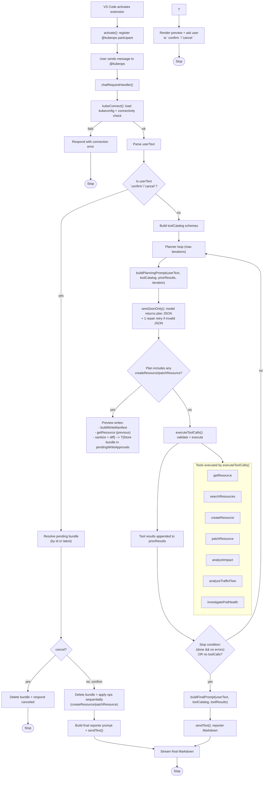

# `src/extension.ts` — Execution Flow (Step-by-Step)

This document explains, in detail, what `src/extension.ts` does at runtime. It describes the end-to-end flow from VS Code extension activation, through Copilot Chat request handling, to Kubernetes/Istio tool execution and final Markdown reporting.

---

### Flow Diagram (Mermaid)



## 1) What this file is responsible for

`src/extension.ts` implements a **GitHub Copilot Chat participant** (`@kubeops`) that:

1. Connects to a Kubernetes cluster using your local kubeconfig rules.
2. Lets a language model **plan** a sequence of tool calls (in strict JSON).
3. Executes those tool calls against the Kubernetes API (read / search / create / patch / analyze).
4. Feeds tool results back into the model and asks it to produce a final Markdown response.

It is effectively a small “agent loop” inside a VS Code extension:

- **Planner (LLM)**: “Which tool calls do I need?”
- **Executor (extension code)**: “Run those tool calls against the cluster.”
- **Reporter (LLM)**: “Explain the outcome using only the tool results.”

---

## 2) Top-level structure

Key exported functions:

- `activate(context)`: registers the chat participant and handler.
- `deactivate()`: currently a no-op.

Key internal functions (high level):

- `chatRequestHandler(...)`: the main orchestration loop (connect → plan → execute → respond).
- `executeToolCalls(session, toolCalls)`: validates and executes tool calls.
- `getResource(...)`: reads one object from the cluster and returns a sanitized manifest + references.
- `searchResources(...)`: lists resources by kind with selectors/filters (identities only).
- `createResource(...)`: creates one object from LM-provided values / yaml.
- `patchResource(...)`: patches one object using **server-side apply**.
- `analyzeImpact(...)`: computes delete-impact severity and dependencies.
- `analyzeTrafficFlow(...)`: discovers traffic graph paths and returns Mermaid.
- `investigatePodHealth(...)`: investigates Pod/Deployment health with events/log evidence.

Support functions:

- Prompt builders: `buildPlanningPrompt`, `buildFinalPrompt`
- Model calls: `sendText`, `sendJsonOnly`, `extractFirstJsonObject`
- Validation: `validateGetResourceArgs`, `validateSearchResourcesArgs`, `validateCreateOrPatchArgs`, `validatePatchArgs`
- Kubernetes/Istio mapping: `normalizeKind`, `resolveApiVersion`, `apiVersionFallbacks`, `isIstioKind`, `isNamespacedKind`
- Manifest shaping: `buildWriteManifest`, `normalizeValuesForKind`, `parseSingleManifestYaml`
- Output shaping: `sanitizeManifest`, `extractReferencedResources`
- Error formatting: `asErrorMessage`, `formatKubernetesHttpError`, `extractKubernetesStatusMessage`, `kubeHttpErrorDetails`
- Write approvals: `previewCreate`, `previewPatch`, `diffForPreview`, `renderWriteApprovalMarkdown`

---

## 3) Activation: registering the chat participant

### 3.1 `activate(context)`

When VS Code activates the extension (based on `activationEvents` in `package.json`), `activate()` runs and:

1. Creates a `vscode.ChatRequestHandler` function that delegates to `chatRequestHandler()`.
2. Registers the handler as a chat participant under the ID:
   - `kubecopilot.kubeops` (must match `contributes.chatParticipants[id]`).
3. Sets the participant icon to `resources/kubeops.svg`.
4. Adds the participant to `context.subscriptions` so VS Code disposes it cleanly.

### 3.2 `deactivate()`

Currently does nothing.

---

## 4) The main flow: `chatRequestHandler(...)`

This function runs every time the user sends a message to `@kubeops`.

### Step 1 — Print a header in the chat

The handler writes:

- `### KubeOps`

to the response stream, as a visible header for the conversation.

### Step 2 — Connect to Kubernetes

It calls:

- `kubeConnect(chatContext, stream)`

If the connection fails, `kubeConnect` prints a friendly error and returns `undefined`, and the handler returns early.

Key details:

- The client uses `@kubernetes/client-node`.
- It loads kubeconfig via `kc.loadFromDefault()`, which respects:
  - `KUBECONFIG`
  - `~/.kube/config`
  - in-cluster config (if running in cluster)
- It tests connectivity by calling `core.listNamespace()`.

### Step 3 — Ensure a language model is available

The handler reads `request.model`:

- If absent, it prints an error and stops.
- If present, it uses it to decide which Copilot model family to send requests to.

### Step 4 — Read the user prompt

The user’s message text is:

- `userText = (request.prompt ?? "").trim()`

If it’s empty, it prints a hint and stops.

### Step 5 — Build the “tool catalog” (tool schema)

The handler constructs a JSON object describing available tools:

- `getResource`
- `searchResources`
- `createResource`
- `patchResource`
- `analyzeImpact`
- `analyzeTrafficFlow`
- `investigatePodHealth`

Each tool entry includes:

- `name`
- `description`
- `inputSchema` (a JSON Schema-like object with properties and required fields)

This catalog is passed into the planner prompt so the model knows:

- which tools exist
- what arguments are expected

### Step 6 — Run an agent loop (planner iterations)

The handler maintains:

- `toolResults: ToolExecutionResult[] = []`
- `iteration = 0`
- `MAX_ITERATIONS = 5`

Then it loops up to 5 times:

#### 6a) Build a planning prompt

`buildPlanningPrompt(userText, toolCatalog, toolResults, iteration)` produces two messages:

1. A “system-like” instruction (created as an assistant message) that forces strict JSON output.
2. A user message that includes:
   - the original user request
   - the iteration number
   - the prior tool results, as JSON (so the model can react to errors / missing info)

#### 6b) Ask the model for a JSON plan

`sendJsonOnly(model, planningPrompt)`:

1. Calls `sendText(...)` to get raw text from the model.
2. Strips common Markdown code fences (best-effort).
3. Extracts the **first JSON object** it can find via `extractFirstJsonObject(...)`.
4. Parses it with `JSON.parse(...)`.
5. Normalizes missing fields:
   - ensures `toolCalls` exists as an array
   - ensures `done` is boolean

If parsing fails, the handler prints:

```
❌ Failed to parse planner output as JSON.
Error: ...
```

The extension also makes one “repair” attempt: it asks the model to rewrite its previous response as strict valid JSON only. If that repair attempt also fails, the handler stops.

Why this can fail:

- The model returns trailing commas, comments, or code fences.
- The model emits multiple JSON objects or extra text.
- The model outputs invalid JSON arrays/objects.

Important limitation:

- `extractFirstJsonObject` is brace-based and does not fully understand JSON strings; it assumes braces `{}` are properly balanced and not confusingly included in string content. It works for typical model outputs but is not a full JSON tokenizer.

#### 6c) Execute tool calls

The plan contains `toolCalls`, each with:

- `tool`: `"getResource" | "searchResources" | "createResource" | "patchResource" | "analyzeImpact" | "analyzeTrafficFlow" | "investigatePodHealth"`
- `args`: the tool-specific argument object

The handler calls:

- `executeToolCalls(session, plan.toolCalls ?? [])`

The results are appended to `toolResults`.

#### 6d) Stop conditions

The loop stops early when either:

1. `plan.done` is true AND no tool execution resulted in an error
2. the planner returns no tool calls at all

Otherwise it increments `iteration` and repeats so the model can adjust based on tool outcomes.

### Step 7 — Produce the final user-facing response

After planning/execution ends, the handler:

1. Builds a “reporter prompt” via `buildFinalPrompt(...)`
2. Calls the model via `sendText(...)`
3. Writes the final Markdown text to the chat stream

The reporter prompt has strict rules:

- “Use ONLY the tool results”
- “Do NOT invent facts”
- “Show resource-specific sections and referenced resources”
- “Handle secret redaction rules”

---

## 5) Tool execution: `executeToolCalls(...)`

This function iterates through tool calls and for each one:

1. Identifies which tool name was requested.
2. Validates the args (type checks + required fields).
3. Calls the corresponding tool implementation.
4. Wraps errors in a consistent shape: `{ error: string, statusCode?: number, statusMessage?: string }`.

Validation helpers:

- `validateGetResourceArgs`
- `validateSearchResourcesArgs`
- `validateCreateOrPatchArgs`
- `validatePatchArgs`

The returned list of `ToolExecutionResult` is what gets fed back into the planner and reporter.

---

## 6) Tool: `getResource` (read one object)

### 6.1 Normalize kind and resolve apiVersion

The tool:

1. Normalizes shorthand kinds using `normalizeKind` (e.g. `po` → `Pod`, `dr` → `DestinationRule`).
2. Resolves `apiVersion` using `resolveApiVersion(kind)` with maps for:
   - core Kubernetes resources (e.g. `apps/v1`, `batch/v1`, `networking.k8s.io/v1`)
   - Istio resources (e.g. `networking.istio.io/v1beta1`, `security.istio.io/v1beta1`)

### 6.2 Determine namespace

If the resource kind is namespaced (via `isNamespacedKind`), it picks:

1. `args.namespace` if provided
2. else kubeconfig current context namespace if set
3. else `"default"`

Cluster-scoped kinds do not set a namespace.

### 6.3 Read the object with apiVersion fallbacks (Istio)

For Istio kinds, `apiVersionFallbacks` tries alternative versions (e.g. `v1beta1`, `v1alpha3`) if the first request fails.

It reads using:

- `k8s.KubernetesObjectApi.makeApiClient(kc).read(baseObj)`

### 6.4 Sanitize output and compute references

The tool returns:

- `identity`: apiVersion/kind/name/namespace
- `sanitizedManifest`: from `sanitizeManifest(...)`
- `referencedResources`: from `extractReferencedResources(...)`
- `events` (optional): recent Events matching `involvedObject.name=<name>` in the same namespace (primarily useful when reading Pods)

Sanitization is designed to:

- keep `spec` and `status`
- keep only minimal metadata
- redact Secret values unless explicitly requested

Referenced resources extraction walks common fields like:

- pod template volumes / envFrom / env.valueFrom
- Ingress backends and ingressClassName
- Istio VirtualService gateways and destinations
- DestinationRule host
- RBAC bindings
- Event involvedObject

---

## 7) Tool: `createResource` (create one object)

Note: This is a write operation and requires explicit user approval. See [Section 13](#13-write-approval-gate-create--patch).

### 7.1 Build a manifest from args

The tool calls:

- `buildWriteManifest(kc, args)`

This constructs a single Kubernetes object manifest using:

- identity (apiVersion/kind/name/namespace)
- either:
  - `manifestYaml` (single YAML document), or
  - `values` (preferred), merged into the manifest

Important behavior:

- Identity fields from tool args win (name/namespace/kind/apiVersion are enforced even if the YAML/values include them).

### 7.2 Attempt create with apiVersion fallbacks (Istio)

It tries candidate versions (Istio fallbacks) and calls:

- `objApi.create(manifest, ..., dryRun, "kubeops")`

If `dryRun=true`, it uses `dryRun=All`.

### 7.3 Return a sanitized manifest

It returns:

- `action: "created"`
- `identity`
- `sanitizedManifest`

---

## 8) Tool: `patchResource` (patch/update one object)

Note: This is a write operation and requires explicit user approval. See [Section 13](#13-write-approval-gate-create--patch).

This tool uses **server-side apply** via `KubernetesObjectApi.patch(...)` with:

- `Content-Type: application/apply-patch+yaml`
- `fieldManager` (default: `"kubeops"`)
- optional `force` to resolve conflicts (default: `false`)

Flow:

1. Build a manifest with `buildWriteManifest(...)`
2. If `requireExists` (default true), read the object first to confirm it exists / is readable.
3. Patch using SSA apply.

Important implication:

- SSA may return **HTTP 409 conflicts** if another field manager owns the same fields.
  - In that case you may choose:
    - `force=true` (aggressive, can steal ownership), or
    - change workflow / ownership conventions.

---

## 9) Tool: `analyzeImpact` (delete-impact analysis)

This tool analyzes what would be affected by either a **delete** or an **update** request. It does not change cluster state.

High-level behavior:

- Dispatches by kind to resource-specific rules (e.g., ConfigMap, Secret, Service, Ingress, VirtualService, Gateway).
- Uses reverse lookup helpers to discover dependent workloads or routing objects.
- Produces:
  - action (`delete` or `update`)
  - optional `changeSummary` for update scenarios
  - overall severity
  - a short summary
  - a list of impacted resources (kind/name/namespace/refType/severity)

This tool powers “impact of deleting …” style questions.

---

## 10) Manifest construction: `buildWriteManifest(...)`

This function is the “manifest builder” used by create/patch.

### 9.1 Determine kind, apiVersion, and namespace

It:

- normalizes kind
- resolves apiVersion (unless overridden)
- determines namespace similarly to `getResource`

### 9.2 Optional YAML parsing

If `manifestYaml` is provided:

- `parseSingleManifestYaml` parses it and enforces exactly **one YAML document**

### 9.3 Value normalization for spec-based resources

`normalizeValuesForKind` exists to help the language model:

- If `values.spec` is **already present**, it does nothing.
- If `values.spec` is **missing** and the kind is in a known list (Pods, Deployments, Services, Istio objects, etc.):
  - it wraps non-metadata keys into `spec`.

Example:

```
values: { host: "nginx", subsets: [...] }
```

becomes:

```
values: { spec: { host: "nginx", subsets: [...] } }
```

This prevents invalid manifests like an Istio `DestinationRule` with `host` at top-level instead of under `spec`.

### 9.4 Merge rules

The builder:

1. Creates a base manifest with identity.
2. Uses the YAML manifest if provided, else uses the base.
3. Re-enforces identity fields.
4. Merges `metadata.labels` and `metadata.annotations` from `values.metadata` into `metadata`.
5. Copies all other keys from `values` onto the manifest (skipping identity keys).

---

## 11) Error handling and diagnostics

### 10.1 Kubernetes HTTP errors

`asErrorMessage` tries to enrich errors that come from the Kubernetes client by:

- extracting `statusCode` and a useful `.message` from a Kubernetes Status body
- appending it to the base error string

`kubeHttpErrorDetails` separately returns structured details that are attached to tool execution results:

- `statusCode?: number`
- `statusMessage?: string`

This helps the model interpret failures (e.g. admission webhook rejections, RBAC 403s, conflicts, etc.).

### 11.2 Planner JSON parse failures

Planner output must be strict JSON. If you see:

> “Expected ',' or ']' after array element...”

it usually means the model emitted something like:

- a trailing comma
- unquoted keys
- multiple JSON objects
- commentary text mixed with JSON

The enforcement mechanism is:

- `buildPlanningPrompt` instructs “Output ONLY valid JSON”
- `sendJsonOnly` extracts the first `{...}` and `JSON.parse`s it
- If parsing fails, `sendJsonOnly` re-prompts once to “rewrite as strict valid JSON only” (repair attempt)

If the model violates the contract twice (initial + repair), the handler stops early.

---

## 12) Extending this file safely

Common extensions:

1. **Support more kinds**
   - Add shorthands to `normalizeKind`
   - Add apiVersion mappings to `resolveApiVersion`
   - Add to `isIstioKind` / `apiVersionFallbacks` if needed

2. **Add new tools**
   - Add tool schema entry in `toolCatalog`
   - Add tool union types (`ToolCall`, args/result types)
   - Add execution branch in `executeToolCalls`
   - Implement the tool method in `KubeSession`

3. **Improve planner reliability**
   - Consider a stricter JSON extraction strategy
   - (Already implemented) Retry once on parse failure with a “repair” prompt
   - Consider validating against a JSON schema rather than ad-hoc type checks

4. **Reduce SSA conflicts**
   - Standardize a field manager for your org/process
   - Avoid mixing `kubectl edit` and SSA applies on the same fields
   - Consider alternative patch strategies for specific resources (only if you can do it safely)

---

## 13) Write approval gate (create + patch)

The extension treats **create** and **patch** as “write operations” that require explicit user approval.

### 13.1 When approval is required

During the planner loop, after a plan is parsed, the extension checks `plan.toolCalls`:

- If there are **any** `createResource` or `patchResource` calls, the extension **does not execute them immediately**.
- Instead, it builds a preview bundle and asks the user to approve it.

Read-only tool calls (`getResource`) are not gated.

### 13.2 What the preview contains

For each write operation in the plan (in order), the extension generates a preview:

- **Target**: kind/name/namespace
- **Requested change input**:
  - `values` (preferred), or
  - `manifestYaml` (single YAML doc)
- **Previous (sanitized)**:
  - For patch: the current resource read from the cluster (sanitized)
  - For create: either “(resource does not exist)” or the current resource if it already exists (sanitized)
- **Proposed (sanitized)**: what the extension will send after constructing a manifest from values/YAML
- **Detected changes**: a path-based diff between previous vs proposed (bounded depth/size)
- **Notes**: warnings like “resource already exists; create will likely fail”

Important: The “previous/proposed” views are the **sanitized** forms (same sanitization used by `getResource`).

### 13.3 How the user approves or cancels

When a preview bundle is created, the extension prints:

- A bundle ID like `write-<timestamp>-<random>`
- Instructions:
  - `confirm <id>` to apply
  - `cancel <id>` to discard

If the user types `confirm` or `cancel` **without an id**, the extension uses the most recently created pending bundle.

### 13.4 What happens on confirm

When the user confirms:

1. The bundle is removed from the in-memory pending store.
2. Each operation in the bundle is applied **sequentially**, in the same order the planner produced them:
   - `createResource` calls execute `session.createResource(args)`
   - `patchResource` calls execute `session.patchResource(args)`
3. The extension then asks the model to write a final report based on the tool results.

### 13.5 What happens on cancel

When the user cancels:

- The pending bundle is deleted from memory and nothing is applied.

### 13.6 Current limitation: pending approvals are in-memory

Pending approvals are stored in an in-memory `Map` in the extension host process.

- If the user never confirms/cancels, the entry will remain until the extension host reloads.
- This can lead to memory growth if many approvals are abandoned.

---

## 14) Tool: `analyzeTrafficFlow` (traffic graph + Mermaid)

`analyzeTrafficFlow` builds a directed traffic graph and Mermaid diagram from a starting object. It is designed to answer questions like “how does traffic reach X” or “what’s upstream/downstream of this Service/Pod/Ingress/VirtualService”.

Implemented behavior:

- Supported start kinds today: `Service`, `Pod`, `Ingress`, `VirtualService` (others return warnings).
- Namespace defaults from kube context when omitted.
- `includeIstio` defaults to true and enables VirtualService/Gateway/DestinationRule discovery.
- `maxDepth` exists in the tool schema but is currently not used for a general BFS expansion (service discovery already does a small multi-hop chain).
- The tool schema also accepts `fromKind`/`fromName`/`fromNamespace` to describe a “source → target” question, but current discovery is primarily target-centric (the `from*` fields are not yet used to constrain discovery).
- Output includes:
  - `nodes[]` (typed traffic nodes)
  - `edges[]` with human-readable `reason`
  - optional `warnings[]`
  - `mermaid` graph text (`graph LR`)

Discovery highlights:

- **Downstream (Service)**: `Service -> EndpointSlice -> Pod` via `kubernetes.io/service-name` label + `endpoints[].targetRef`.
- **Upstream (Ingress)**: `Ingress -> Service` by scanning ingress backends.
- **Istio routing** (when `includeIstio=true`):
  - `Gateway -> VirtualService` (gateway referenced by VS)
  - `VirtualService -> DestinationRule -> Service` when a matching DestinationRule host is found
  - else `VirtualService -> Service` directly via destination hosts
- **NetworkPolicy evidence (best-effort)**:
  - When discovering pods behind a Service, the analyzer may attach `NetworkPolicy -> Pod` edges to show policies selecting the destination pod and whether ingress could be blocked (limited evaluation).

Analyzer package structure:

- `src/analyzer/trafficFlowAnalyzer.ts`: entrypoint + start object existence checks.
- `src/analyzer/traffic/router.ts`: dispatch by start kind.
- `src/analyzer/traffic/discover/*.ts`: discovery logic per source kind.
- `src/analyzer/traffic/discover/networkPolicyFlow.ts`: best-effort NetworkPolicy evaluation for destination pods.
- `src/analyzer/traffic/k8s.ts`: Kubernetes/Istio API helpers (including EndpointSlice lookup fallback).
- `src/analyzer/traffic/graph.ts`: graph builder + edge de-dup.
- `src/analyzer/traffic/mermaid.ts`: graph-to-Mermaid rendering.
- `src/analyzer/traffic/types.ts`: args/result graph types.

---

## 15) Tool: `investigatePodHealth` (pod/deployment health investigation)

`investigatePodHealth` collects structured evidence to explain why a Pod (or pods under a Deployment) are unhealthy.

Supported start kinds:

- `Pod`: investigates that single Pod
- `Deployment`: lists pods for the deployment selector and inspects up to `maxPods` (preferring “worst” pods: not-ready, then bad phase, then restarts)

Evidence gathered (best-effort):

- Pod phase, readiness, restarts, node
- Pod conditions and container states (waiting/terminated reasons)
- Recent Events (newest first)
- Recent container logs (per container, tail + sinceSeconds)
- Probe summaries (readiness/liveness/startup)
- Service/Endpoint evidence: which Services select the pod, and whether it appears in EndpointSlices
- PVC and Node condition hints
- NetworkPolicies selecting the pod (matchLabels-only, bounded list)

---

## 16) Tool: `searchResources` (list/find identities)

`searchResources` is used when the user asks to list/find resources of a given kind using selectors or a name substring, without needing full manifests.

Example questions:

- “List pods with label `app=nginx` in `default`”
- “Find services containing `payments` in the name”
- “Show NetworkPolicies with `team=platform`”

### 16.1 Inputs and constraints

Inputs:

- `kind` (required)
- `namespace` (optional; defaults the same way as other namespaced tools)
- `labelSelector` (optional, server-side), e.g. `app=nginx,version=v1`
- `fieldSelector` (optional, server-side), e.g. `metadata.name=nginx` (field selectors are limited and kind-dependent)
- `nameContains` (optional, client-side substring filter)
- `limit` (optional; default 25, max 100)

Important constraint: at least **one** of `nameContains`, `labelSelector`, or `fieldSelector` must be provided. If none are present, the extension rejects the tool call and returns an error (the planner prompt also instructs the model not to call `searchResources` without a filter).

### 16.2 Execution behavior

The tool:

1. Normalizes kind and resolves apiVersion similarly to `getResource`.
2. Lists resources using server-side `labelSelector` / `fieldSelector` when provided.
3. Applies `nameContains` as a client-side filter over returned items.
4. Returns **identities only** (no full manifests), capped to `limit`.

### 16.3 Output shape

The result includes:

- `kind` / `namespace` (if applicable)
- `query` echo (filters applied and effective limit)
- `results[]`: list of `{ apiVersion, kind, name, namespace? }`
- `returned`: number of results returned
- `truncated`: whether the result set was truncated due to `limit`

---

## 17) Quick mental model summary

In one sentence:

`extension.ts` runs a “plan → execute → report” loop where the model outputs strict JSON tool calls, the extension runs them against Kubernetes, and the model then writes a Markdown report using only the tool results.
